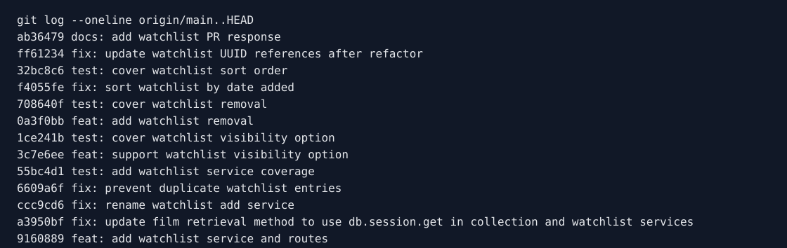

# PR Response Doc - CineLog Watchlist Feature

## AI Usage
I used Codex to inspect the repository, compare the watchlist implementation with the existing collection service pattern, make the code changes, and run verification commands. I also used it to stress-test the Comment 4 and Comment 5 design responses. The useful counterarguments were that public-by-default can surprise users and that alphabetical sorting helps lookup; I kept those points in the final responses and addressed them with an explicit `public` override and a future `?sort=title` option rather than ignoring them.

I also used Codex to check the rewritten `git log --format=%s origin/main..HEAD` output against the conventional commit prefixes before capturing the history image below.

## Comment 1 - Rename
**What I did:** Renamed `save_to_watchlist()` to `add_to_watchlist()` in `services/watchlist_service.py`, then updated the watchlist route import and POST handler in `routes/watchlist/watchlist.py`. This matches the existing `verb_to_noun` service convention used by `add_to_collection()`, `remove_from_collection()`, and `get_collection()`.

**How I verified:** I searched the service and route code for `save_to_watchlist` and confirmed there were no remaining code references. I also ran the full test suite with `/tmp/cinelog-venv/bin/python -m pytest tests/ -v -p no:cacheprovider`.

## Comment 2 - Deduplication
**What I did:** Added an `AlreadyInWatchlistError`, checked `WatchlistEntry.query.filter_by(user_id=user_id, film_id=film_id).first()` before inserting, and returned a 409 from the route when a duplicate add is attempted. I also added a `unique_user_film_watchlist` database constraint so the model mirrors the existing collection model's one-film-per-user invariant.

**How I verified:** I compared the implementation against `add_to_collection()` and its `AlreadyInCollectionError` path, then ran `/tmp/cinelog-venv/bin/python -m pytest tests/ -v -p no:cacheprovider`. The dedicated duplicate test is added under Comment 3/stretch coverage below.

## Comment 3 - Missing test
**What I did:** Created `tests/test_watchlist.py` and added the required nonexistent-film test for `add_to_watchlist()`, modeled on `test_add_to_collection_nonexistent_film_raises`. I also added happy-path and duplicate tests because `CONTRIBUTING.md` asks new service functions to cover successful creation, duplicate/conflict handling, and nonexistent IDs.

**How I verified:** I ran `/tmp/cinelog-venv/bin/python -m pytest tests/test_watchlist.py -v -p no:cacheprovider` for the new test file and `/tmp/cinelog-venv/bin/python -m pytest tests/ -v -p no:cacheprovider` for the full suite.

## Comment 4 - Default visibility
**My position:** Keep `public=True` as the default, but make visibility explicit at the endpoint by accepting a `public` JSON parameter on `POST /watchlist/<user_id>/add`.

**Reasoning:** CineLog is framed as a community film tracking app, and the existing collection API already exposes user film lists by user ID. For a watchlist, the common community behavior I am optimizing for is sharing what a user hopes to watch next so friends can recommend, discuss, or discover films. Keeping the default public also preserves the original model default and avoids surprising existing callers of `add_to_watchlist()` who omitted visibility.

I agreed with the privacy concern behind the review comment, so I added an explicit visibility toggle instead of relying only on the model default. Callers can now send `"public": false` when the user chooses a private save, while callers that do not yet have a visibility UI keep the existing public behavior.

**Tradeoff acknowledged:** A private-by-default watchlist would reduce the chance of accidental sharing, especially before CineLog has authentication, per-user preferences, or a UI confirmation step. The downside is that it would make the community-facing behavior opt-in and would silently change existing API behavior. I think the better current tradeoff is public-by-default with an explicit private override, and I would revisit the default once CineLog has account-level privacy settings.

## Comment 5 - Sort order
**My position:** Use date-added descending for `get_watchlist()`, matching the maintainer's preference and the existing `get_collection()` behavior.

**Reasoning:** A watchlist is a time-based queue of intent: the most recently saved films are usually the ones closest to the user's current interest. Returning newest-first makes the endpoint useful for "what did I just save?" and keeps it consistent with `get_collection()`, which already returns newest-first. That consistency matters because collection and watchlist are parallel user-film lists in this codebase.

**Engagement with reviewer's point:** Alphabetical order is useful when the user is scanning for a known title, and that was the strongest reason to keep the original implementation. I changed the default anyway because alphabetical order discards the user's save timeline, which is more meaningful for a watchlist feed. If CineLog later needs both workflows, I would add an explicit sort option such as `?sort=title` rather than making alphabetical the only behavior.

## Comment 6 - Rebase
**What conflicted:** `models.py` conflicted during `git rebase origin/main` while replaying the watchlist deduplication commit. `main` had migrated `Film.id` and `CollectionEntry.film_id` from integers to UUID strings, while the watchlist branch was still adding `WatchlistEntry.film_id` as an integer foreign key.

**How I resolved it:** I kept the post-refactor UUID model from `main`, added `WatchlistEntry` with `film_id = db.Column(db.String(36), db.ForeignKey("film.id"), nullable=False)`, preserved the `unique_user_film_watchlist` constraint, and kept the watchlist relationship backrefs needed by `get_watchlist()`. After the rebase, I also updated stale watchlist service and route docstrings that still described `film_id` as an integer.

**How I verified no conflict remains:** I searched the repo for Git conflict-marker tokens, searched for stale integer film-ID references in watchlist code, confirmed `git log --merges --oneline origin/main..HEAD` produced no merge commits, and ran `/tmp/cinelog-venv/bin/python -m pytest tests/ -v -p no:cacheprovider` with all 11 tests passing.

## Stretch Features
**remove_from_watchlist():** I added `remove_from_watchlist(user_id, film_id)` in `services/watchlist_service.py`, following the same query/delete/commit pattern as `remove_from_collection()`. I also added a `NotInWatchlistError` and a DELETE `/watchlist/<user_id>/remove` endpoint so the service behavior is exposed consistently with collection removal.

**Additional tests:** Beyond the requested nonexistent-film test, I added tests for successful add, duplicate add, explicit private visibility, successful removal, missing removal, and newest-first sort order. I chose the sort-order test as the extra edge case because the original implementation sorted alphabetically and the test uses titles where alphabetical order would fail, so it protects the design decision in Comment 5.

**Visibility toggle:** I added an optional `public` parameter to the add endpoint. `POST /watchlist/<user_id>/add` now accepts `{ "film_id": "<uuid>", "public": false }`, validates that `public` is a boolean, and passes it to `add_to_watchlist()`. Omitting `public` keeps the default `True`.

## Commit History


## PR Description
### Summary
This PR adds CineLog watchlist support so users can save films they want to watch later, fetch their watchlist, and remove saved films. The service now prevents duplicate watchlist entries, returns useful 404/409 API errors, supports UUID film IDs after the main-branch refactor, and includes watchlist test coverage for add, duplicate, missing film, visibility, removal, and sort order.

### Design decisions
I kept watchlist entries public by default because CineLog is a community film tracking app and shared watchlists support discovery and recommendations. To address the privacy tradeoff, callers can now set `"public": false` explicitly when adding a film.

I changed watchlist retrieval to date-added descending. That matches `get_collection()` and preserves the user's save timeline; alphabetical lookup can be added later as an explicit sort option if the API needs both workflows.

### Manual testing
1. Install dependencies and run tests:
   ```bash
   python3 -m pytest tests/ -v
   ```

2. Seed one manual user and film, then copy the printed IDs:
   ```bash
   python3 - <<'PY'
   import uuid
   from app import create_app, db
   from models import User, Film

   app = create_app()
   with app.app_context():
       suffix = str(uuid.uuid4())[:8]
       user = User(username=f"manual-{suffix}", email=f"manual-{suffix}@example.com")
       film = Film(title=f"Manual Test Film {suffix}", year=2026, genre="Drama")
       db.session.add_all([user, film])
       db.session.commit()
       print("USER_ID=", user.id)
       print("FILM_ID=", film.id)
   PY
   ```

3. Start the app:
   ```bash
   python3 app.py
   ```

4. Add a private watchlist entry:
   ```bash
   curl -X POST "http://127.0.0.1:5000/watchlist/$USER_ID/add" \
     -H "Content-Type: application/json" \
     -d "{\"film_id\":\"$FILM_ID\",\"public\":false}"
   ```

5. Fetch the watchlist and confirm the film appears with `"public": false`:
   ```bash
   curl "http://127.0.0.1:5000/watchlist/$USER_ID"
   ```

6. Repeat the add request and confirm the duplicate returns HTTP 409.

7. Remove the entry and confirm the response says it was removed:
   ```bash
   curl -X DELETE "http://127.0.0.1:5000/watchlist/$USER_ID/remove" \
     -H "Content-Type: application/json" \
     -d "{\"film_id\":\"$FILM_ID\"}"
   ```
